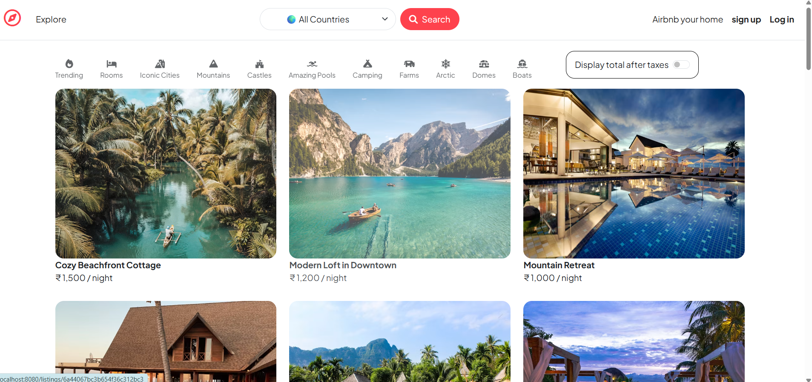
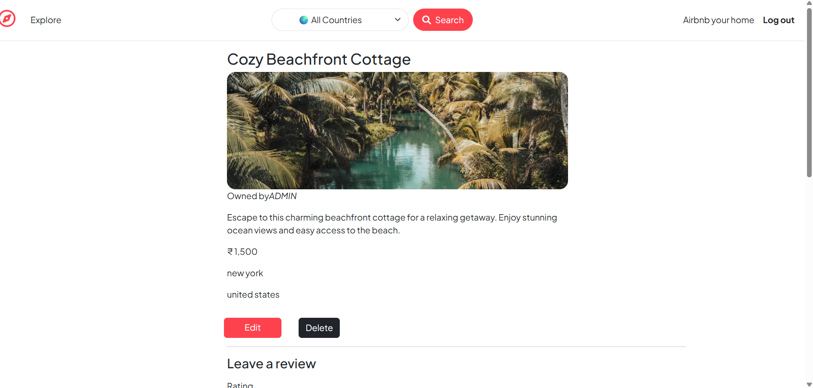
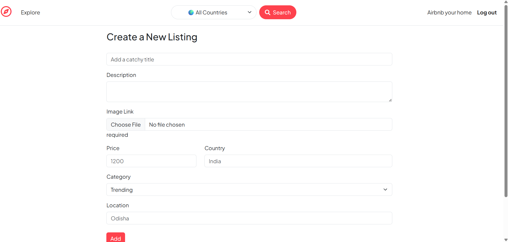
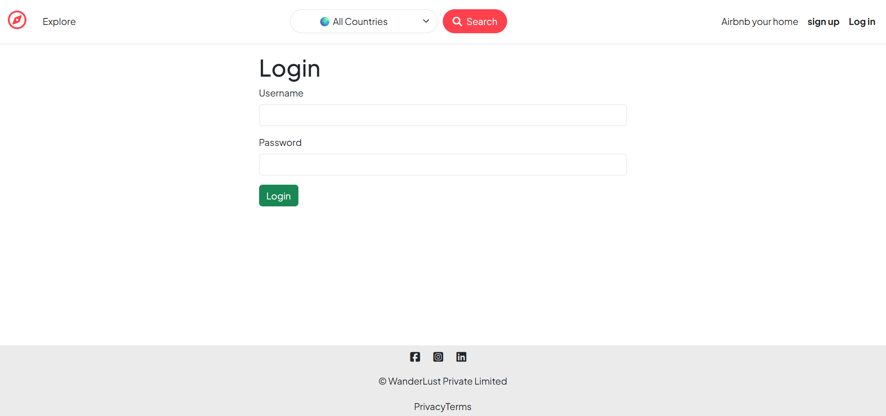
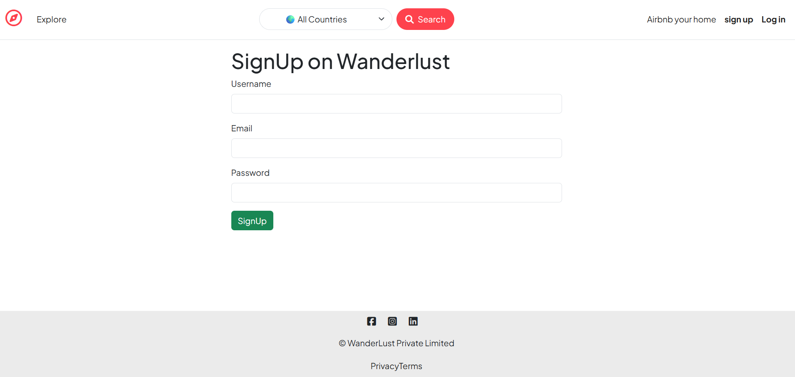

# 🏡 Wanderlust

A full-stack Airbnb-inspired web application where users can create, explore, review, and manage property listings.

---

# 📸 Screenshots

## Home Page



---

## Listing Details



---

## Add Listing



---

## Login



---

## Signup



---

# ✨ Features

- ✅ User Authentication
- ✅ Create Listings
- ✅ Edit Listings
- ✅ Delete Listings
- ✅ Reviews & Ratings
- ✅ Search by Country
- ✅ Cloudinary Image Upload
- ✅ Interactive Maps
- ✅ Flash Messages
- ✅ Responsive Design

---

# 🛠 Tech Stack

- Node.js
- Express.js
- MongoDB Atlas
- Mongoose
- EJS
- Bootstrap
- Passport.js
- Cloudinary
- Mapbox

---

# 🚀 Installation

```bash
npm install
npm start
```

---

# 🔑 Environment Variables

Create a `.env` file:

```env
ATLASDB_URL=your_mongodb_connection_string
CLOUD_NAME=your_cloud_name
CLOUD_API_KEY=your_cloud_api_key
CLOUD_API_SECRET=your_cloud_api_secret
```

---

# 👨‍💻 Author

**Siddharth Mohanty**
